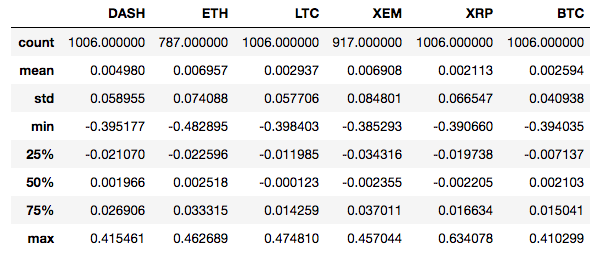
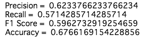

# 仮想通貨を機械学習

GoogleがTensorflowを使って、世界の株価のデータを機械学習させ、次の日の株価が上がるか否かを予想するというサンプルを公開している。

- [サンプルの動画のリンク](https://www.youtube.com/watch?v=N422_CYuzZg&feature=youtu.be)
- [サンプルのソースコードとその解説のリンク](https://github.com/corrieelston/datalab/blob/master/FinancialTimeSeriesTensorFlow.ipynb)

そこで、このサンプルを仮想通貨に適用してみたら、どのような結果が出るのだろうか、ということを試みた。
サンプルのソースコードを適用するにあたって、[TensorFlowを投資につかうまで 衝撃のサンプル編 (1)](https://qiita.com/verizi/items/2685ed83b69a6830848e)のシリーズも非常に参考にした。Googleのサンプルは英語なので、英語が苦手な人はこちらのシリーズを読むと良いと思う。
 
開発環境は以下の通り。
 
 - Python 3.5.2
 - TensorFlow 1.3.0
 - jupyter 1.0.0

## データのsetup

仮想通貨のデータの用意・加工については、[ANALYZING CRYPTOCURRENCY MARKETS USING PYTHON](https://blog.patricktriest.com/analyzing-cryptocurrencies-python/?utm_source=hackernews)を非常に参考にしている。詳しい説明はそちらを読んで頂きたい。

### まずは必要なlibraryを読み込む

```python
import os
import tensorflow as tf
import numpy as np
import pandas as pd
import pickle
import quandl
from datetime import datetime, date, timedelta
import matplotlib.pyplot  as plt
plt.style.use('ggplot')
```

### Bitcoinの価格データの取得

Bitcoinの価格のデータは[QuandlのAPI for Bitcoin Data](https://blog.quandl.com/api-for-bitcoin-data)から取ってくる。  

まず、Quandlからダウンロードして、データをキャッシュする関数を書く。  
データはpickleで保存して、次回以降はキャッシュからデータを取ってくる。  
取得したデータはPandasのDataFrameで返す。

```python
def get_quandl_data(quandl_id):
    cache_path = '{}.pkl'.format(quandl_id).replace('/', '-')
    try:
        f = open(cache_path, 'rb')
        df = pickle.load(f)   
    except (OSError, IOError) as e:
        df = quandl.get(quandl_id, returns="pandas")
        df.to_pickle(cache_path)
    return df
```

Bitcoinの価格は仮想通貨取引所によって異なる。そこで複数の取引所のデータの平均を取る。

```python
exchanges = ['KRAKEN', 'COINBASE', 'BITSTAMP', 'ITBIT']
exchange_data = {}
for exchange in exchanges:
    exchange_code = 'BCHARTS/{}USD'.format(exchange)
    btn_change_df = get_quandl_data(exchange_code)
    exchange_data[exchange] = btn_change_df
```

複数のデータをマージして、1つのDataFrameとして返す関数を書く。

```python
def merge_dfs(dataframes, labels, col):
    series_dict = {}
    for index in range(len(dataframes)):
        series_dict[labels[index]] = dataframes[index][col]
        
    return pd.DataFrame(series_dict)
```

それぞれの取引所のデータから"Weighted Price"の列を取り出して、1つにまとめる。
    
```python
btc_datasets = merge_dfs(list(exchange_data.values()), \
                         list(exchange_data.keys()), 'Weighted Price')
```

データをプロットするための関数を書く。

```python
def df_plot(df, title):
    fig = plt.figure()
    fig.set_figwidth(15)
    fig.set_figheight(10)
    
    for column in df.columns:
        plt.plot(df[column], label=column)
    
    plt.legend(loc='upper left', frameon=False)
    plt.title(title)
    plt.show()
```

取得したデータを確認してみる。

```python
df_plot(btc_datasets, 'Bitcoin Price (USD) By Enchange')
```


取引所、またはデータ取得の問題で、価格が0になっているポイントが複数ある。0は欠損値として処理する。

```python
btc_datasets.replace(0, np.nan, inplace=True)
```
それぞれの取引所の価格の平均をとり、新たな列として加える。  
データをプロットして、0の値が無くなっていることを確認する。

```python
btc_datasets['avg_btc'] = btc_datasets.mean(axis=1)
fig = plt.figure()
fig.set_figwidth(15)
fig.set_figheight(10)
plt.plot(btc_datasets['avg_btc'])
plt.show()
```


### Altcoinの価格データの取得

次にaltcoinのデータを取得していく。  
altcoinのデータは[PoloniexのAPI](https://poloniex.com/support/api/)を使用する。

Poloniex APIはJSON形式で返ってくる。Bitcoinと同様、URLリクエストから返ってきたJSONデータをキャッシュする関数を書く。

```python
def get_json_data(json_url, cache_path):
    try:
        f = open(cache_path, 'rb')
        df = pickle.load(f)
    except (OSError, IOError) as e:
        df = pd.read_json(json_url)
        df.to_pickle(cache_path)
    return df
```

次に、APIリクエストを送るURLを生成し、リクエストを送り、DataFrameを返す関数を書く。  
2015年からの昨日までの毎日の価格データを取得する。  
関数は引数として仮想通貨のペアをとる(例: 'BTC_ETH')。取得されるデータは一方のレートに換算された価格になる。

```python
base_polo_url = 'https://poloniex.com/public?command=returnChartData&currencyPair={}&start={}&end={}&period={}'
start_date = datetime.strptime('2015-01-01', '%Y-%m-%d')
# 今日の日付だと欠損値の場合があるので、１日前のデータまでを取得する
end_date = date.today() - timedelta(1) 
period = 86400

def get_crypto_data(poloniex_pair):
    json_url = base_polo_url.format(poloniex_pair, start_date.timestamp(), \
                                    end_date, period)
    data_df = get_json_data(json_url, poloniex_pair)
    data_df = data_df.set_index('date')
    return data_df
```

今回、[流通の時価総額のTop](https://coinmarketcap.com)に入っている6つのaltcoin(Ethereum,  Ripple, Litecoin, Dash, NEM, NEO)を使う。価格のレートはBitcoinを使う。

```python
altcoins = ['ETH','XRP','LTC','DASH','XEM']

altcoin_data = {}
for altcoin in altcoins:
    coinpair = 'BTC_{}'.format(altcoin)
    crypto_df = get_crypto_data(coinpair)
    altcoin_data[altcoin] = crypto_df
```

先に作ったBitcoinの価格のデータを用いて、altcoinの価格をUSDに換算する。データを１つのDataFrameに統合し、Bitcoinのデータも付け加える。

```python
for altcoin in altcoin_data.keys():
    altcoin_data[altcoin]['price_usd'] =  altcoin_data[altcoin]['weightedAverage'] * btc_datasets['avg_btc']

combined_df = merge_dfs(list(altcoin_data.values()), list(altcoin_data.keys()), 'price_usd')
combined_df['BTC'] = btc_datasets['avg_btc']
```

完成したデータをプロットする。

```python
df_plot(combined_df, 'Cryptcurrency Prices (USD)')
```


ビットコインの価格が突出し過ぎていて見にくいが、とりあえずデータが揃っていることが分かる。

## Exploratory Data Analysis (EDA)

ここからはGoogleのサンプルに沿って、分析を進めていく。  
初めは探索的データ解析(Exploratory Data Analysis)ということで、データを概観していく。

```python
combined_df.describe()
```


まず気になるのは、通貨同士で価格の水準が大きく異なることである。  
Googleのサンプルでは、それぞれの指標の最大値で割ることで正規化を行っている。  
しかし、今回もう1つの問題として、同じ通貨内であっても最小値と最大値が大きく乖離している。これは2017年からの急上昇によって、それ以前と以後で価格帯が変わってしまったからだ。  
そこで、最大値で割って、さらに自然対数をとって正規化を行う。

```python
normalized_df = pd.DataFrame()
coins = list(combined_df.keys())

for coin in coins:
    normalized_df[coin] = combined_df[coin] / combined_df.max()[coin]
    
df_plot(np.log(normalized_df), 'Normalized Prices')
```


グラフが見やすくなった。  
全体として右上がりの傾向が確認でき、相関関係があると予想される。また、個々の通貨同士で特徴が似ているものもある(ETHとXEM、LTCとXRP)。

次に自己相関をみる。自己相関とは、現在の値が過去の値からどれだけの影響があるかをみる指標である。

```python
coins = list(combined_df.keys())
from pandas.plotting import autocorrelation_plot

fig = plt.figure()
fig.set_figwidth(15)
fig.set_figheight(10)

for coin in coins:
    autocorrelation_plot(np.log(normalized_df[coin][:-1]), label=coin)

plt.legend(loc='upper right', frameon=False)
plt.show()
```


lagの値が小さければ(グラフの左側)、より直近の価格との関係を示す。大きくなると(グラフの右側)、より過去の価格との関係を示す。  
多くの時系列データと同様に、直近では正の相関を強く示し、離れるにつれて相関は小さくなる。

次に、他の通貨との相関関係をみる。

```python
from pandas.plotting import scatter_matrix

scatter_matrix(np.log(normalized_df), figsize=(20, 20), diagonal='kde')

plt.show()
```


仮想通貨同士で強い相関関係があることが分かる。
個々の特徴をみると、XRPの相関関係は他と比べて形がいびつである。また、先に指摘したETHとXEMには確かに綺麗な相関関係がみられる。

しかし、往々にして時系列データは自己相関も含めて、相関関係が強く出るものである。よって、そのままのデータでは真の特徴や相関関係を分析するのは難しい。そこで、1日にどれだけ価格が変化するか、に注目して分析する。

自然対数同士の差は真数が0に近い場合に、変化率となる。この性質を利用する。当日と1日前の価格に自然対数をとって、その差をとると1日前からの価格の変化率が分かる。  
0に近い数値が必要なので正規化されたデータを使い、変化率をとって新たなDataFrameを作る。

```python
log_return_df = pd.DataFrame()

for coin in coins:
    log_return_df[coin] = \
        np.log(normalized_df[coin]/normalized_df[coin].shift())

log_return_df.describe()
```



平均は0.01をきり、0に非常に近い値となっている。

データの大きさの水準を確認するためにプロットしてみる。

```python
df_plot(log_return_df, 'Rate of Change')
```


しばしば突起が見られるが、概ね0付近に集合していることが分かる。そして、それ以外には特に何か傾向が見当たらなくなった。

試しに自己相関をみてみると、

```python
fig = plt.figure()
fig.set_figwidth(20)
fig.set_figheight(15)

for coin in list(coins):
    autocorrelation_plot(log_return_df[coin][:-1], label=coin)

plt.legend(loc='upper right', frameon=False)
plt.show()
```


全く自己相関が見られなくなった。つまり、前日に価格が上がったからといって、今日上がる保証は全くないのである。これが株価でも見られるランダムウォークである。

それでは、通貨同士の相関関係はどのようになったのか。

```python
scatter_matrix(log_return_df, figsize=(20, 20), diagonal='kde')
plt.show()
```


相関関係も殆どなくなってしまったようだ。詳しい数値は以下の通りである。

```python
log_return_df.corr()
```


どの数値も低いが、BTCとDASH、BTCとLTCは他と比べれば多少数値が高い。

### Bitcoinの値動きを予想しよう

変化率の相関係数を見て、Bitcoinと他の通貨との相関が比較的に高いことが分かった。そこで今回は、データを機械学習してBitcoinが値上がりするか、値下がりするかを予想してみようと思う。

ランダムウォークということで、望みは薄いが、一応数日前の通貨とBitcoinの相関関係も見ておく。そこで、日にちを引数にとり、それぞれの通貨を日にちの分だけ後にシフトする関数を書く。

```python
def shift_date(before):
    tmp = pd.DataFrame()
    for coin in coins:
        if coin is not 'BTC':
            tmp[coin] = log_return_df[coin].shift(periods=before)
        else:
            tmp['BTC'] = log_return_df[coin]
            tmp['BTC_{}'.format(str(before))] = \
                log_return_df[coin].shift(periods=before)
    return tmp
```

まず、1日前のデータと比べてみる。

```python
delay1_df = shift_date(1)
delay1_df.corr()['BTC']
```


やはり、どの通貨とも相関がほぼ全くない。唯一、BTC自身の前日のデータとは少し相関があるようだ。2日前のデータとも比べてみよう。

```python
delay2_df = shift_date(2)
delay2_df.corr()['BTC']
```


Bitcoin自身との相関もなくなった。

#### 特徴量を選ぶ

では、今回特徴量として

- 当日のBitcoin以外の価格
- Bitcoinを含めた1~3日前の通貨の価格

を用いて、その日のBitcoinの値動き(上がるか下がるか)を予想する。  
3日前までのデータを含める必要があるかは怪しいが、あとで減らすことも出来るので、これでやってみる。

#### 訓練データとテストデータを作る

まずは、値上がりしたか、値下がりしたかの情報が入っている新たな列を作る。  
変化率なので、単純に正であれば値上がり、負であれば値下がりである。

```python
log_return_df['btc_log_return_positive'] = 0
log_return_df.loc[log_return_df['BTC'] >= 0, \
                   'btc_log_return_positive'] = 1
log_return_df['btc_log_return_negative'] = 0
log_return_df.loc[log_return_df['BTC'] < 0, \
                   'btc_log_return_negative'] = 1
```

次に、その日のBTC以外のデータ、3日前までの各通貨の過去のデータ、BTCの値上がり/値下がりの結果のデータを格納したDataFrameを作る。

```python
columns = ["positive", "negative"]
columns += altcoins
for i in range(1, 4) :
    columns += ['{}_{}'.format(coin, str(i)) for coin in coins]
    
training_tests_data = pd.DataFrame(columns=columns)
training_tests_data["positive"] = log_return_df["btc_log_return_positive"]
training_tests_data["negative"] = log_return_df["btc_log_return_negative"]
for coin in coins:
    # ここでNANを0にしておく。
    log_return_df[coin] = np.nan_to_num(log_return_df[coin])
    if coin is not 'BTC':
        training_tests_data[coin] = log_return_df[coin]
    for before in range(1, 4) :
        training_tests_data['{}_{}'.format(coin, str(before))] = \
            log_return_df[coin].shift(periods=before)
```

log\_return\_dfの最初の値がNANであり、最大で3日分を後にシフトをしたので、最初の4日分にNANが入っている。その部分を削り、一応確認をする。

```python
training_tests_data = training_tests_data[4:]
training_tests_data.head()
```


次に、データを特徴量として使うデータと分類のクラスに分ける。  
そして、80%を訓練データ、残りの20%をテストデータに振り分ける。ETHとXEMの最初に0が並んでいたり、2017年前後でデータの傾向が変わっているので、ランダムで振り分ける。ランダムで振り分けるために、scikit-learnのtrain\_test\_splitを使う。

```python
from sklearn.cross_validation import train_test_split

predictors = training_tests_data[training_tests_data.columns[2:]]
classes = training_tests_data[training_tests_data.columns[:2]]

training_predictors, test_predictors, training_classes, test_classes = \
    train_test_split(predictors, classes, test_size=0.2)
```

### モデルの評価

モデルの評価の指標として、以下の3つを導入する。

- Precision: 下がっていることを正しく判断する確率
- Recall: 上がっていることを正しく判断する確率
- F1 Score: PrecisionとRecallの加重平均
- Accuracy: テストデータを正しく判断する確率

```python
def tf_confusion_metrics(model, actual_classes, session, feed_dict):
    predictions = tf.argmax(model, 1)
    actuals = tf.argmax(actual_classes, 1)

    ones_like_actuals = tf.ones_like(actuals)
    zeros_like_actuals = tf.zeros_like(actuals)
    ones_like_predictions = tf.ones_like(predictions)
    zeros_like_predictions = tf.zeros_like(predictions)

    tp_op = tf.reduce_sum(
      tf.cast(
        tf.logical_and(
          tf.equal(actuals, ones_like_actuals),
          tf.equal(predictions, ones_like_predictions)
        ),
        "float"
      )
    )

    tn_op = tf.reduce_sum(
      tf.cast(
        tf.logical_and(
          tf.equal(actuals, zeros_like_actuals),
          tf.equal(predictions, zeros_like_predictions)
        ),
        "float"
      )
    )

    fp_op = tf.reduce_sum(
      tf.cast(
        tf.logical_and(
          tf.equal(actuals, zeros_like_actuals),
          tf.equal(predictions, ones_like_predictions)
        ),
        "float"
      )
    )

    fn_op = tf.reduce_sum(
      tf.cast(
        tf.logical_and(
          tf.equal(actuals, ones_like_actuals),
          tf.equal(predictions, zeros_like_predictions)
        ),
        "float"
      )
    )

    tp, tn, fp, fn = \
      session.run(
        [tp_op, tn_op, fp_op, fn_op],
        feed_dict
      )

    tpr = float(tp)/(float(tp) + float(fn))
    fpr = float(fp)/(float(tp) + float(fn))

    accuracy = (float(tp) + float(tn))/(float(tp) + float(fp) + float(fn) + float(tn))

    recall = tpr
    precision = float(tp)/(float(tp) + float(fp))

    f1_score = (2 * (precision * recall)) / (precision + recall)

    print('Precision = ', precision)
    print('Recall = ', recall)
    print('F1 Score = ', f1_score)
    print('Accuracy = ', accuracy)
```

### モデルの作成
 
ここからやっとTensorFlowを使ってモデルを作っていく。  
最初は隠れ層のない非常に単純なモデルで試してみる。出力層ではsoftmax関数を使い、損失関数は交差エントロピー誤差を使用する。

```python
sess = tf.Session()

num_predictors = len(training_predictors.columns)
num_classes = len(training_classes.columns)

feature_data = tf.placeholder(tf.float32, [None, num_predictors])
actual_classes = tf.placeholder(tf.float32, [None, num_classes])

weights = tf.Variable(tf.truncated_normal([num_predictors, num_classes], stddev=0.0001))
biases = tf.Variable(tf.ones([num_classes]))

model = tf.nn.softmax(tf.matmul(feature_data, weights) + biases)

cost = -tf.reduce_sum(actual_classes*tf.log(model))

training_step = tf.train.AdamOptimizer(learning_rate=0.0001).minimize(cost)

init = tf.global_variables_initializer()
sess.run(init)
```

このモデルを使って、30000回繰り返して学習させる。

```python
correct_prediction = tf.equal(tf.argmax(model, 1), tf.argmax(actual_classes, 1))
accuracy = tf.reduce_mean(tf.cast(correct_prediction, tf.float32))

for i in range(1, 30001):
    sess.run(
        training_step, 
        feed_dict={
          feature_data: training_predictors.values, 
          actual_classes: training_classes.values.reshape(len(training_classes.values), 2)
        }
    )
    if i%5000 == 0:
        print(i, sess.run(
          accuracy,
          feed_dict={
            feature_data: training_predictors.values, 
            actual_classes: training_classes.values.reshape(len(training_classes.values), 2)
          }
    )) 
```   


驚くことに、70%を超えるなかなか高い数字となった。

テストデータも見てみる。

```python
feed_dict= {
  feature_data: test_predictors.values,
  actual_classes: test_classes.values.reshape(len(test_classes.values), 2)
}

tf_confusion_metrics(model, actual_classes, sess, feed_dict)
```


F1 Scoreは0.55。GoogleのサンプルのF1 Scoreがこの時点で0.36だったことを考えると、高い数値だと思われる。

では、次に2つの隠れ層を加えて試してみよう。隠れ層の活性化関数はReLUを使用する。

```python
sess1 = tf.Session()

num_predictors = len(training_predictors.columns)
num_classes = len(training_classes.columns)

feature_data = tf.placeholder(tf.float32, [None, num_predictors])
actual_classes = tf.placeholder(tf.float32, [None, 2])

weights1 = tf.Variable(tf.truncated_normal([23, 50], stddev=0.0001))
biases1 = tf.Variable(tf.ones([50]))

weights2 = tf.Variable(tf.truncated_normal([50, 25], stddev=0.0001))
biases2 = tf.Variable(tf.ones([25]))
                     
weights3 = tf.Variable(tf.truncated_normal([25, 2], stddev=0.0001))
biases3 = tf.Variable(tf.ones([2]))

hidden_layer_1 = tf.nn.relu(tf.matmul(feature_data, weights1) + biases1)
hidden_layer_2 = tf.nn.relu(tf.matmul(hidden_layer_1, weights2) + biases2)
model = tf.nn.softmax(tf.matmul(hidden_layer_2, weights3) + biases3)

cost = -tf.reduce_sum(actual_classes*tf.log(model))

train_op1 = tf.train.AdamOptimizer(learning_rate=0.0001).minimize(cost)

init =tf.global_variables_initializer()
sess1.run(init)
```

同様に30000回学習させる。

```python

correct_prediction = tf.equal(tf.argmax(model, 1), tf.argmax(actual_classes, 1))
accuracy = tf.reduce_mean(tf.cast(correct_prediction, tf.float32))

for i in range(1, 30001):
    sess1.run(
    train_op1, 
    feed_dict={
      feature_data: training_predictors.values, 
      actual_classes: training_classes.values.reshape(len(training_classes.values), 2)
    }
    )
    if i%5000 == 0:
        print(i, sess1.run(
          accuracy,
          feed_dict={
            feature_data: training_predictors.values, 
            actual_classes: training_classes.values.reshape(len(training_classes.values), 2)
          }
        ))
```


なんと80%を超えた。

テストデータを見ると、

```python
feed_dict= {
  feature_data: test_predictors.values,
  actual_classes: test_classes.values.reshape(len(test_classes.values), 2)
}

tf_confusion_metrics(model, actual_classes, sess1, feed_dict)
```



こちらもF1 Scoreが増えている。しかし、Googleのサンプルでは、隠れ層を2つ使うとF1 Scoreが0.69まで改善されていた。テストデータのAccuracyはこちらの方が高いので、過学習が起きてしまっていると予想される。

##　感想
それっぽい結果が出て一応安心した。  
実際にモデルをいじくる前にデータの加工などで力尽きた感が否めないので、次回は機械学習の方に注力したいと思う。

$to\ be\ conitued...$
